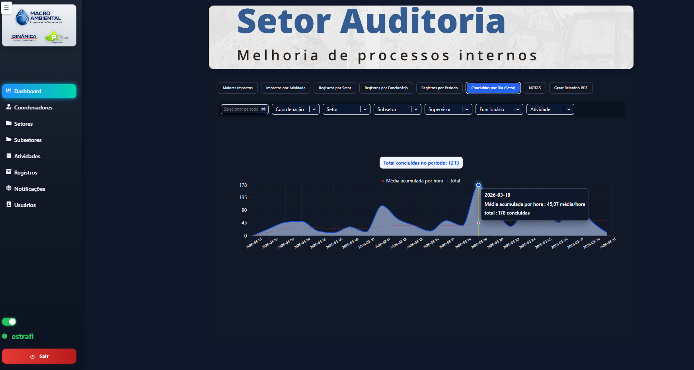
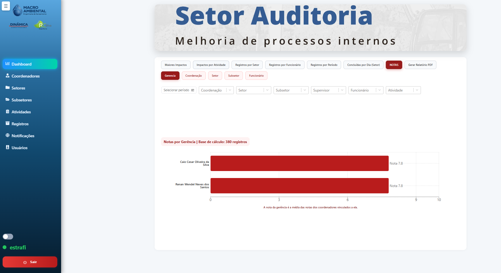
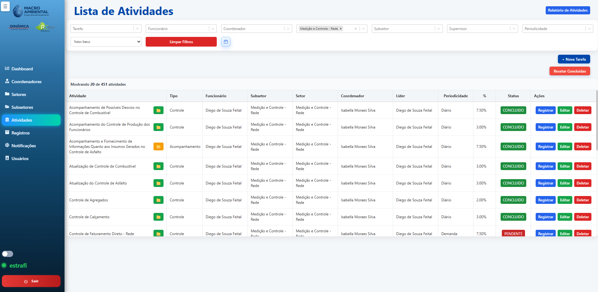
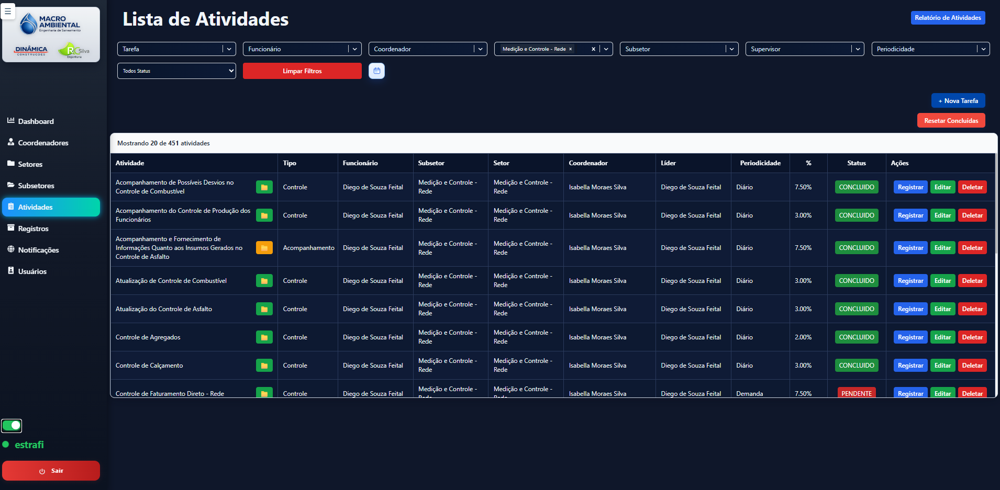

<p align="center">
  
</p>

<br><br>

### Presentation

This project was conceived and developed within the context of the **Audit Department**, with the objective of optimizing internal processes, improving activity traceability, and providing greater visibility into operational performance.

The solution consists of a comprehensive management system, including task control, sector performance analysis, checklist model management, and integration with a modern, intuitive, and responsive interface.

The development was carried out following software engineering best practices, with a focus on scalability, code organization, maintainability, and user experience.


### Apresentação

O projeto foi idealizado e implementado no contexto do Setor de Auditoria, com o objetivo de otimizar processos internos, melhorar a rastreabilidade das atividades e fornecer maior visibilidade sobre o desempenho operacional.

A solução contempla um sistema completo de gestão, incluindo controle de tarefas, análise de desempenho por setor, gerenciamento de modelos de checklist e integração com interface moderna e responsiva.

O desenvolvimento foi realizado utilizando boas práticas de engenharia de software, com foco em escalabilidade, organização do código e experiência do usuário.

<p align="center">
  
</p>

<p align="center">
  
</p>

<p align="center">
  
</p>

<p align="center">
  
</p>


# Auditoria API – Audit Management System

## 📌 Overview

The **Auditoria API** is a robust, secure, and scalable backend system designed to manage audit processes, tasks, and sector performance within organizations.

It integrates seamlessly with a modern **React frontend**, enabling real-time operations, role-based access control, and advanced reporting.

---

## 🚀 Key Features

- ✔️ Complete Audit Workflow  
  Manage coordinators, supervisors, sectors, sub-sectors, tasks, and users.

- 🔐 Secure Authentication  
  JWT-based login with role-based access control.

- 📊 Performance Metrics  
  Real-time dashboards and historical tracking of sector performance.

- 📁 Document Management  
  Upload and download of files (Excel/PDF models supported).

- 🔔 Notifications  
  Real-time updates for approvals, requests, and task completions.

- 📱 Responsive UI  
  Mobile-friendly interface with dark mode support.

---

## 📈 Sector Performance Impact

| Before | After |
|------|------|
| Manual tracking | Automated workflows |
| Delayed reports | Real-time dashboards |
| Low visibility | Full audit traceability |

> "After implementing the system, task completion time decreased by **40%**, and managers gained real-time visibility."

---

## 🛡️ Security

- 🔑 Password hashing with **bcrypt**
- 🔐 JWT authentication (stateless sessions)
- 👥 Role-based access:
  - Admin
  - Developer
  - Coordinator
  - Supervisor
  - User
- 📂 File validation (secure upload handling)

---

## 🛠️ Tech Stack

### Backend
- Node.js
- PostgreSQL

### Frontend
- React
- Vite

### Security
- JWT
- bcrypt

### Deployment
- Render
- Docker-ready


---

## 📚 API Endpoints

| Endpoint | Description |
|--------|------------|
| `/api/auth/login` | User authentication |
| `/api/checklist-modelos` | Manage checklist models |
| `/api/estoques` | Equipment management |
| `/api/tarefas` | Task management |
| `/api/usuarios` | User management |

---


✔️ Ensures compatibility across different environments  
✔️ Avoids machine-dependent paths  

---

## ▶️ Running the Project

### Backend

```bash
npm run dev
```

### Frontend

```bash
npm install
npm run dev
```

# 🧾 Auditoria API – Sistema de Gestão de Auditorias

## 📌 Visão Geral

A **Auditoria API** é um sistema backend robusto, seguro e escalável, desenvolvido para gerenciar processos de auditoria, tarefas e desempenho de setores dentro de organizações.

Ela se integra perfeitamente a um frontend moderno em **React**, permitindo operações em tempo real, controle de acesso por perfil e relatórios avançados.

---

## 🚀 Principais Funcionalidades

- ✔️ Fluxo Completo de Auditoria  
  Gerenciamento de coordenadores, supervisores, setores, subsetores, tarefas e usuários.

- 🔐 Autenticação Segura  
  Login baseado em JWT com controle de acesso por perfil.

- 📊 Métricas de Desempenho  
  Dashboards em tempo real e acompanhamento histórico do desempenho dos setores.

- 📁 Gestão de Documentos  
  Upload e download de arquivos (suporte a modelos em Excel/PDF).

- 🔔 Notificações  
  Atualizações em tempo real para aprovações, solicitações e conclusão de tarefas.

- 📱 Interface Responsiva  
  Interface moderna, adaptada para dispositivos móveis e com suporte a modo escuro.

---

## 📈 Impacto no Desempenho dos Setores

| Antes | Depois |
|------|------|
| Controle manual | Fluxos automatizados |
| Relatórios demorados | Dashboards em tempo real |
| Baixa visibilidade | Rastreabilidade completa |

> "Após a implementação do sistema, o tempo de conclusão de tarefas foi reduzido em **40%**, e os gestores passaram a ter visibilidade em tempo real."

---

## 🛡️ Segurança

- 🔑 Criptografia de senhas com **bcrypt**
- 🔐 Autenticação JWT (sessões sem estado)
- 👥 Controle de acesso por perfil:
  - Admin
  - Desenvolvedor
  - Coordenador
  - Supervisor
  - Usuário
- 📂 Validação de arquivos com upload seguro

---

## 🛠️ Tecnologias Utilizadas

### Backend
- Node.js
- PostgreSQL

### Frontend
- React
- Vite

### Segurança
- JWT
- bcrypt

### Deploy
- Render
- Docker-ready

---

## 📚 Endpoints da API

| Endpoint | Descrição |
|--------|------------|
| `/api/auth/login` | Autenticação de usuários |
| `/api/checklist-modelos` | Gerenciamento de modelos de checklist |
| `/api/estoques` | Gerenciamento de equipamentos |
| `/api/tarefas` | Gerenciamento de tarefas |
| `/api/usuarios` | Gerenciamento de usuários |

---

✔️ Garante compatibilidade entre diferentes ambientes  
✔️ Evita dependência de caminhos específicos da máquina  

<br><br>

<p align="">
  
</p>

## Desenvolvido por

**Ester Soares Serafim**  
Estudante do 3º período de Engenharia de Software  

🔗 https://github.com/Soares243
